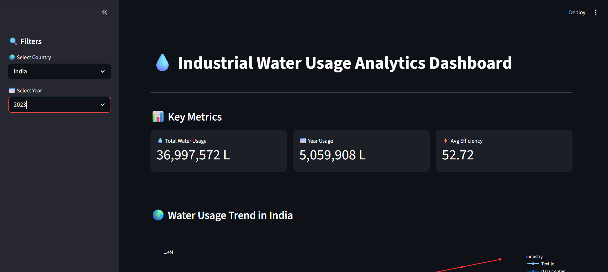
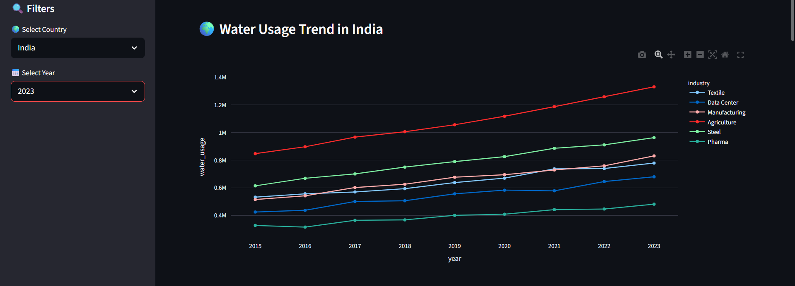
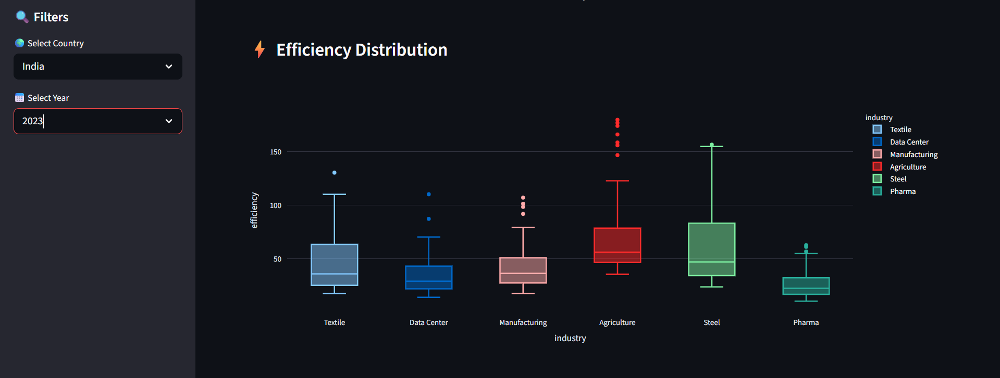
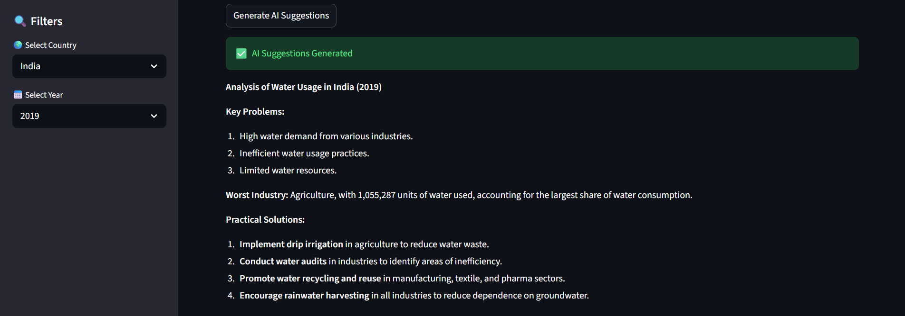

# Industrial Water Usage Analytics

## Overview
This project analyzes industrial water usage across different industries and countries. It provides insights, visualization, and AI-based recommendations.

## Features
- Interactive dashboard (Streamlit)
- Industry-wise and global analysis
- What-if simulation
- AI-powered sustainability insights

## Tech Stack
- Python
- Pandas
- Apache Spark
- Streamlit
- Plotly
- Groq LLM API

## Setup

### 1. Clone repo
git clone <your_repo_url>

### 2. Install dependencies
pip install -r requirements.txt

### 3. Setup environment variables
Create `.env` file:

GROQ_API_KEY=your_key_here

### 4. Run app
streamlit run app.py

## Screenshots

## Future Scope
- Real-time IoT data integration
- Cloud deployment
- Predictive analytics